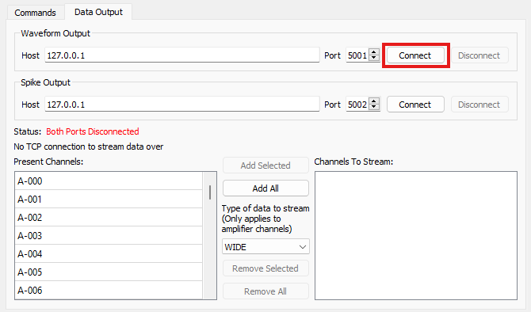

# Real-time Decoder

This repository contains scripts for performing real-time classification of electromyography (EMG) data using a trained machine learning model. The scripts are designed to work with data collected using the Intan RHX system and the Intan Waveform Generator software. The real-time classification is performed using a trained model that was saved using the `gesture_classifier` scripts.

## Setup

1. If not done already, clone the repository and navigate to the `realtime_decoder` directory:
    ```bash
    git clone
    cd Intan_EMG_Python/realtime_decoder
    ```
2. Get the trained model file generated from the `gesture_classifier` directory (or your own) and update the `config.txt` file with the path to the model.
    - Note: be sure to pass the path of the config file as an argument during the training process. 
3. To perform real-time classification of EMG data, you need to have an Intan system connected to your computer with the sampling rate set to 4kHz. Enable the "Waveform Output" and "Commands" servers from `Remote TCP Control` tab with default settings:




## Real-time Classification
The real-time classification of gestures from EMG data is performed using the `realtime_decode.py` script. This script reads EMG data from the Intan system via TCP/IP and classifies the data using a trained model. The classification results are displayed in the terminal. Optional arguments are displayed:
```bash
python realtime_decode.py --config_path config.txt --channels [1:8, 64:72] --use_serial --port COM3 --verbose
``` 

- The default search path for the `config.txt` file is the parent directory. Change it to wherever your config file is located.
- The `--channels` argument specifies the channels to use for classification. Enter any range of channels your EMG system supports, matching how the model was trained
- The `--use_serial` argument enables sending serial commands to a serial device (like a robot arm!).
- The `--port` argument specifies the serial port to use in conjunction with a serial device.
- The `--verbose` argument enables verbose output.